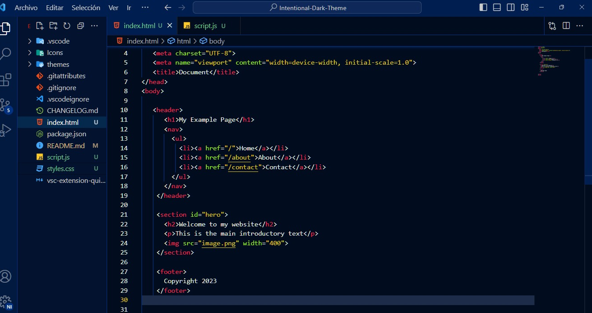
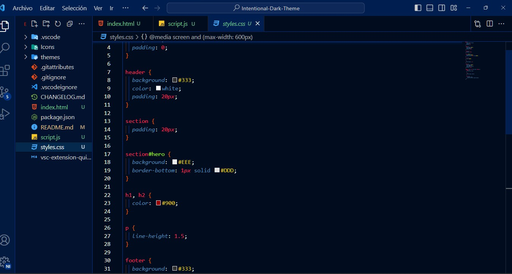
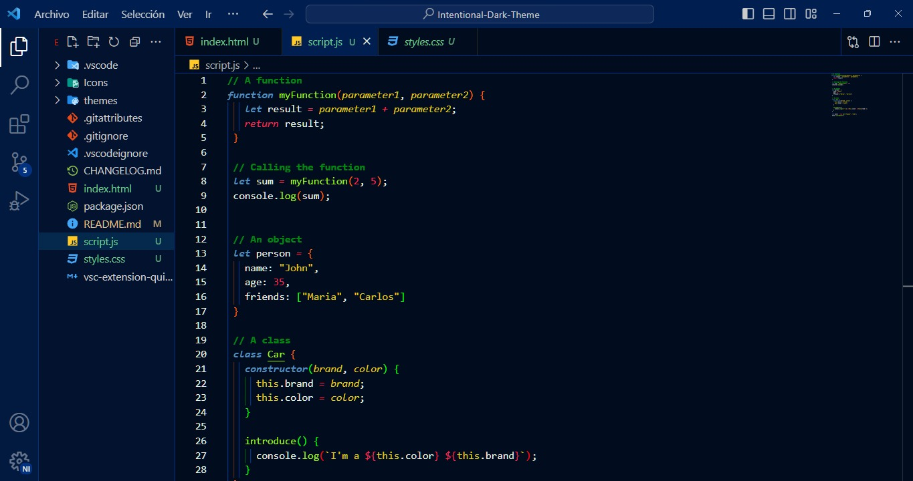

   <h1 style="font-family: Comic Sans MS; font-size: 3em; font-weight:900 ;">Intentional Dark Theme</h1>
   
   <h2 style="font-family: Comic Sans MS; font-size: 1.3em; margin:3em 0 0 0; font-weight:200">A very soft navy color theme</h2>

   

      
      
      
   

   <h2>How to install:</h2>
   <ol>
      <li>Open the Extensions sidebar in VS Code.</li>
      <li>Just search for Intentional Dark. Choose the one by Intentional-Co</li>
      <li>Click the Install button</li>
      <li>Go to Preferences ‣ Color Theme ‣ Monokai Vibrant</li>
   </ol>

   <h2>Details:</h2>
   

      I suggest you use the following code into your settings.json, this will help to get a vibrant color into the theme :point_down:

      {
         "workbench.statusBar.visible": false,
         "workbench.colorTheme": "Intentional-Theme",
         "explorer.confirmDelete": false,
         "workbench.colorCustomizations": {
            "editorBracketHighlight.foreground1": "#FF6600",
            "editorBracketHighlight.foreground2": "#00ff00",
            "editorBracketHighlight.foreground3": "#ff0000",
            "editorBracketHighlight.foreground4": "#5a01ff",
            "editorBracketHighlight.foreground5": "#ffe100",
            "editorBracketHighlight.foreground6": "#000dff",
            "editorBracketHighlight.unexpectedBracket.foreground": "#db6165",
            "editorBracketMatch.background": "#ffffff34",
            "editorBracketMatch.border": "#ffffff2e",
         },

         "editor.tokenColorCustomizations": {
            "comments": "#07fc0380",      
         },
         "editor.guides.bracketPairs": true,
         "editor.autoClosingBrackets": "always",
         "git.confirmSync": false,
         "editor.fontSize": 13,
         "editor.tabSize": 3,
         "git.enableSmartCommit": true,
         "window.zoomLevel": 1,
         "terminal.integrated.env.windows": {},
         "liveServer.settings.donotShowInfoMsg": true,
         "console-ninja.featureSet": "Community",
         "explorer.confirmDragAndDrop": false,
         "workbench.iconTheme": "material-icon-theme"
      }
   

